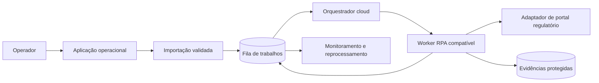

# Orquestração de Processamento Fiscal

Reconstrução pública de um projeto **entregue**: processamento de documentos fiscais por uma fila rastreável, combinando aplicativo operacional, orquestração em nuvem e workers RPA.

> Este repositório é uma reconstrução segura para portfólio. Diagramas, contratos, nomes e dados foram recriados de forma genérica. Ele não contém aplicativo, automações, robôs, planilhas, portais, credenciais, parâmetros, evidências ou configurações de qualquer implementação corporativa.

## Contexto

Processos fiscais recorrentes podem exigir interação com múltiplos portais regulatórios. O padrão deste case recebe um lote de documentos, cria trabalhos idempotentes, direciona cada trabalho para um worker compatível, registra o resultado e permite reprocessamento controlado.

## O que este case demonstra

- Fila de processamento com estados explícitos e chave de idempotência.
- Orquestração entre uma aplicação operacional, Dataverse, automações em nuvem e workers RPA.
- Separação entre o envio do lote, o processamento assíncrono e o monitoramento.
- Retentativas limitadas, bloqueio de trabalho e registro estruturado de falhas.
- Contrato JSON, exemplo totalmente sintético e cenários de teste.

## Arquitetura pública



Consulte a [arquitetura detalhada](docs/architecture.md), o [contrato da fila](models/fiscal_job.schema.json), a [amostra sintética](samples/fiscal_job.sample.json) e os [cenários de teste](docs/test_scenarios.md).

## Status e limites

- **Status:** Entregue (projeto corporativo em operação); este repositório é a reconstrução pública, sem ativos reais.
- **Evidências públicas:** documentação reescrita, diagrama, modelo de job, dados sintéticos e testes de contrato.
- **Não alegado:** execução em produção, volume, tempo de processamento, conexão ativa, disponibilidade de robôs ou integração com terceiros.

## Validação local

```powershell
python -m pip install jsonschema
python -c "import json; from jsonschema import validate; validate(json.load(open('samples/fiscal_job.sample.json', encoding='utf-8')), json.load(open('models/fiscal_job.schema.json', encoding='utf-8'))); print('sample valid')"
```

O schema valida a estrutura. As transições de estado, a expiração de bloqueio e a política de retentativas são regras comportamentais cobertas nos [cenários de teste](docs/test_scenarios.md).

## Tecnologias e práticas representadas

`Power Apps Canvas` · `Dataverse` · `Power Automate Cloud` · `Power Automate Desktop` · `RPA` · `Fila idempotente` · `Observabilidade`

## Segurança do material público

Leia [public_safety.md](docs/public_safety.md) antes de reutilizar o conteúdo. Qualquer extensão deve manter todos os dados e integrações como sintéticos.
