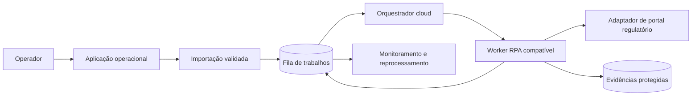

# Orquestração de Processamento Fiscal

Este repositório é a **arquitetura-alvo** de uma orquestração fiscal com aplicativo, fila no Dataverse, orquestrador em nuvem e robôs RPA. Ele foi reconstruído do zero, sem dado de cliente, a partir de um projeto corporativo que está **em produção numa versão mais simples**, descrita abaixo.

> Nada aqui foi exportado de um ambiente real. Diagramas, contratos, nomes e dados são genéricos. Não há aplicativo, fluxo, robô, planilha, portal, credencial, parâmetro, evidência ou configuração de implementação corporativa.

## O que está em produção

A versão em produção faz o mesmo percurso com menos mecanismo:

- O operador importa a planilha fiscal num aplicativo Power Apps Canvas. Um cloud flow lê o arquivo; o app mostra a prévia, separa as linhas com erro e grava as válidas no Dataverse por Patch.
- A fila trabalha por **lote** (um por estabelecimento em cada importação), e a deduplicação fica na **nota**: uma chave alternativa por nota impede que reimportar a mesma planilha duplique registros.
- Cada lote tem três status. O app fecha o lote como "pronto para o robô"; esse trio é o contrato entre o app e o robô.
- Um orquestrador (cloud flow de disparo manual) pega **um lote pronto** a cada disparo e aciona **um robô Power Automate Desktop desacompanhado**, que processa as notas do lote no portal nacional de NFS-e. O contrato de status prevê que o robô devolva o resultado ao lote; do lado do robô, esse retorno ainda não foi implementado. O operador acompanha os status no app.
- O orquestrador passa ao robô só o nome do lote e o ambiente. O robô repete a etapa que falhou até 5 tentativas.
- Lote com falha continua com os três status e volta no próximo disparo; como a consulta não ordena, um lote que sempre falha pode travar a fila. Dois disparos seguidos também pegam o mesmo lote, porque o status só muda quando o lote termina: "um lote por vez" vale com um robô e um disparo por vez.

Não há reserva com prazo, identificação de worker, batimento, liberação automática de execução travada, workers por categoria nem repositório de evidências. Esses mecanismos são o que este repositório descreve.

## Papel do autor

Com meu time, fiz a importação, o aplicativo, o modelo de dados no Dataverse e o contrato de status com o robô. O orquestrador e o robô são de outra equipe (time de automação). Este repositório (arquitetura-alvo, contrato da fila, dados sintéticos e cenários de teste) é trabalho meu, reconstruído para publicação.

## Arquitetura-alvo (próxima evolução)

A arquitetura-alvo troca "um lote por vez" por uma fila de trabalhos com reserva: cada trabalho é reservado por um worker compatível com a categoria do portal, com prazo; se o prazo vence sem confirmação, o trabalho volta à fila. As evidências ficam num repositório protegido, fora da tela do operador.


```mermaid
flowchart LR
    O[Operador] --> A[Aplicação operacional]
    A --> I[Importação validada]
    I --> Q[(Fila de trabalhos)]
    Q --> C[Orquestrador cloud]
    C --> W[Worker RPA compatível]
    W --> P[Adaptador de portal regulatório]
    W --> E[(Evidências protegidas)]
    W --> Q
    Q --> M[Monitoramento e reprocessamento]
```

| Mecanismo | Em produção | Arquitetura-alvo |
| --- | --- | --- |
| Unidade da fila | Lote | Trabalho (job) |
| Seleção | Um lote pronto por disparo, pelos três status | Reserva com `lock_expires_at` por worker |
| Execução | Um robô desacompanhado, portal nacional de NFS-e | Workers por categoria de portal |
| Deduplicação | Chave alternativa por nota | `job_key` por trabalho |
| Execução travada | Sem liberação automática | Reserva vencida volta a `Pending` |
| Evidências | Fora do escopo | Repositório protegido, só metadados na tela |

Consulte a [arquitetura detalhada](docs/architecture.md), o [contrato da fila](models/fiscal_job.schema.json), a [amostra sintética](samples/fiscal_job.sample.json) e os [cenários de teste](docs/test_scenarios.md).

## Status e limites

- **Projeto de origem:** entregue e em produção, na versão simplificada descrita acima.
- **Este repositório:** arquitetura-alvo da próxima evolução. Documentação, diagrama, modelo de job, dados sintéticos e testes de contrato; não é o que roda em produção.
- **Não publicado:** volume e tempo de ciclo. Este repositório não tem conexão ativa, robô nem integração com terceiros.

## Validação local

```powershell
python -m pip install jsonschema
python -c "import json; from jsonschema import validate; validate(json.load(open('samples/fiscal_job.sample.json', encoding='utf-8')), json.load(open('models/fiscal_job.schema.json', encoding='utf-8'))); print('sample valid')"
```

O schema valida a estrutura. As transições de estado, a expiração de bloqueio e a política de retentativas são regras comportamentais da arquitetura-alvo, cobertas nos [cenários de teste](docs/test_scenarios.md).

## Tecnologias e práticas representadas

`Power Apps Canvas` · `Dataverse` · `Power Automate Cloud` · `Power Automate Desktop` · `RPA` · `Fila idempotente`

## Segurança do material público

Leia [public_safety.md](docs/public_safety.md) antes de reutilizar o conteúdo. Qualquer extensão deve manter todos os dados e integrações como sintéticos.
