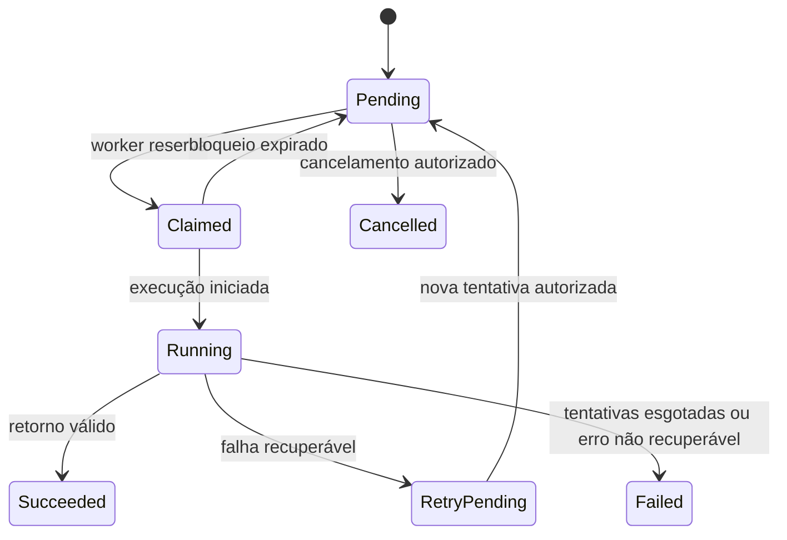

# Arquitetura de referência

## Objetivo

Organizar o processamento assíncrono de documentos fiscais sem acoplar a interface de operação aos portais externos. A arquitetura mantém o trabalho rastreável, permite distribuição por capacidade e evita a criação duplicada de jobs.

## Componentes

| Componente | Responsabilidade | Limite público |
| --- | --- | --- |
| Aplicação operacional | Importar lote, consultar fila e iniciar reprocessamentos autorizados | Referência de UX e processo, sem exportação de aplicativo |
| Camada de importação | Validar estrutura e converter cada linha em trabalho lógico | Não inclui arquivo de origem nem mapeamentos reais |
| Fila de trabalhos | Persistir estado, tentativas, bloqueio e correlação | Modelo lógico sem ambiente ou tabela real |
| Orquestrador cloud | Selecionar trabalho pendente e worker compatível | Descrição de padrão, sem fluxo exportado |
| Worker RPA | Executar uma adaptação de portal e devolver resultado estruturado | Sem robô, URL, seletor ou credencial |
| Evidências protegidas | Armazenar artefatos produzidos pelo worker com controle de acesso | Apenas metadados no case público |

## Ciclo de vida de um job

## Regras de desenho

1. Cada `job_key` identifica logicamente um trabalho importado. Reenvios não devem gerar duplicidade.
2. O claim do worker usa `lock_expires_at`; se o worker não confirmar a execução, o job pode voltar à fila com segurança.
3. Workers só recebem trabalhos compatíveis com a categoria exigida e não recebem segredos no payload público.
4. Falhas temporárias retornam a `retry_pending` até `max_attempts`; falhas definitivas ficam rastreáveis em `failed`.
5. Logs e evidências devem usar correlação e mascaramento adequado; o case não armazena conteúdos de documentos nem capturas de tela.

## Decisões de governança

- Uma implementação deve manter URLs, credenciais e parâmetros por ambiente em cofre de segredos e variáveis de ambiente.
- O operador acompanha o resultado por status e resumo, não por acesso a informações sensíveis da automação.
- Para jobs e logs com relacionamento e requisitos de auditoria, Dataverse é uma opção coerente; a escolha final depende de volume, licenciamento e política de dados.
